  
  
  
  

---

### whoami

Software engineer at **[247Labs](https://247labs.com)**, based in Alexandria, Egypt.

I build APIs that don't surprise you in production — typed all the way down, tested at the boundaries, deployed without ceremony. Laravel is my daily driver; React Native is what I reach for when an API needs hands.

---

### what I'm building

> **HealthSync** — a private API + iOS app that unifies Apple Health and Hevy strength data, then exposes it through an MCP server so I can ask Claude *"how's my Pull trending vs last month?"* and get a real answer.
>  `Laravel 13` · `Sail` · `Sanctum` · `Pest` · `Larastan max` · `React Native + Expo` · `EAS Update` · `MCP`

> **[eloquent-documents](https://github.com/yehia-khalil/eloquent-documents)** — small Laravel package for attaching documents to any Eloquent model, the way I wish it worked out of the box.

> **[keep-track](https://github.com/yehia-khalil/keep-track)** — fitness goals tracker. The first thing I built when I started lifting seriously.

---

### tools I reach for

  
   
  
   
  

**Daily**: PHP 8 / Laravel · Pest · Larastan (level max) · MySQL · Redis · Docker · React Native + Expo · TypeScript
 **Tooling**: Claude Code with custom MCP servers · GitHub Actions · OrbStack
 **Past lives**: Ruby on Rails · vanilla JS / React · Python · a little Godot

---

### things I care about

- **Boring infrastructure.** The exciting parts of an app should be the features, not the deploy.
- **Strict static analysis from day one.** Larastan `level max` isn't a stretch goal — it's table stakes.
- **Tests that catch real bugs**, not coverage theater.
- **Letting AI do the parts of my job I'd rather not** — so I can focus on the parts I won't delegate.

---

### the numbers

---

### off the keyboard

Training six days a week. Half the reason **HealthSync** exists is so I can stop tab-switching between Apple Health and Hevy to answer simple questions about my own programming.

---

Reachable at <b>yehia.khalil@247labs.com</b> · open to interesting work.

